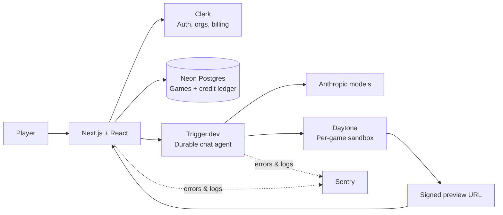

<div align="center">
  
  <h1>GameGenPlay</h1>
  <p><strong>Describe a 3D game, then watch an AI agent plan, build, and preview it in an isolated runtime.</strong></p>

  <p>
    
    
    
    
    
    
    
  </p>
</div>

---

## Overview

GameGenPlay is an agentic 3D-game workspace. A player starts with a plain-language prompt; the app creates a game thread, provisions an isolated Daytona sandbox, and runs a durable Trigger.dev chat agent that can inspect and modify the game files. The result is served through a signed preview URL in the workspace beside the conversation.

The product keeps the important boundaries explicit: browser interaction stays in React, durable game/thread state stays in Postgres, long-running agent work stays in Trigger.dev, and generated code executes only in a per-game Daytona sandbox.

## Features

| Capability                 | Implementation                                                                                                              |
| -------------------------- | --------------------------------------------------------------------------------------------------------------------------- |
| Prompt-to-game workflow    | A new game stores its opening prompt and starts a durable chat session.                                                     |
| Guided agent turns         | The agent can ask a focused design question before writing, then read, create, update, and delete sandbox files.            |
| Isolated playable previews | Each game receives a Daytona sandbox and a signed iframe preview URL.                                                       |
| Resumable chat             | Messages, access token, and stream cursor are persisted together so a reload can resume safely.                             |
| Model selection            | Opus 5, Sonnet 5, and Haiku 4.5 are offered with one catalog shared by UI, runtime, and billing.                            |
| Credit ledger              | Usage is charged per model step using idempotent Postgres ledger entries; subscription grants are reconciled through Clerk. |
| Organization isolation     | Every player-facing game operation is scoped to the active Clerk organization.                                              |
| Observability              | Sentry captures web and worker failures without uploading prompts or generated source in HTTP bodies.                       |

## Architecture



### State ownership

| State                                                   | Owner                   | Why                                                                  |
| ------------------------------------------------------- | ----------------------- | -------------------------------------------------------------------- |
| Composer, selected model, split-pane interaction        | React client components | Must remain immediate and interactive.                               |
| Game metadata, message history, chat cursor, sandbox id | Postgres via Drizzle    | Must survive reloads and be available to server actions and workers. |
| Multi-step agent execution                              | Trigger.dev             | Runs can outlive a browser tab and can retry safely.                 |
| Generated game files and static server                  | Daytona sandbox         | Generated code stays isolated from the application runtime.          |
| Identity, active organization, subscriptions            | Clerk                   | Centralizes account, organization, and billing state.                |

## Workflow engine

1. The player creates a game from a prompt. The server action validates the active organization, stores the opening message, and redirects into the game thread.
2. The chat server action authorizes ownership and verifies the organization has credit before creating a session-scoped Trigger token.
3. On the first turn, the worker creates and seeds the game’s Daytona sandbox with the bundled runtime.
4. The agent hydrates durable messages, persists the current turn before streaming, and runs a bounded read/edit loop against that game’s sandbox.
5. Each model step is priced and written as an idempotent ledger entry. A completed turn stores the updated messages and stream cursor atomically.
6. The preview route authorizes the game, wakes its sandbox server when needed, and returns a short-lived signed URL for the iframe.

The agent is intentionally bounded to 48 tool/model steps per turn. File paths are normalized inside the game directory, file writes have size limits, and tool errors are returned as recoverable feedback so the agent can correct its next step.

## AI capabilities

GameGenPlay uses Anthropic models through the AI SDK:

| Model     | Best fit                                                           |
| --------- | ------------------------------------------------------------------ |
| Opus 5    | Starting a game from scratch and more demanding design/build work. |
| Sonnet 5  | Fast, capable iteration on an existing game.                       |
| Haiku 4.5 | Small, focused changes and game-title generation.                  |

The model catalog is the shared contract for the picker, Trigger agent, and pricing layer. That prevents a UI-selectable model from being unavailable at runtime or billed under a different identifier.

## Tech stack

| Area                 | Technology                                        |
| -------------------- | ------------------------------------------------- |
| App                  | Next.js 16, React 19, TypeScript                  |
| Styling and UI       | Tailwind CSS 4, shadcn/ui, Base UI, Framer Motion |
| AI                   | Vercel AI SDK, Anthropic                          |
| Durable work         | Trigger.dev 4                                     |
| Isolated execution   | Daytona SDK                                       |
| Data                 | Neon Postgres, Drizzle ORM                        |
| Identity and billing | Clerk                                             |
| Monitoring           | Sentry                                            |

## Installation

### Prerequisites

- Node.js 24 (the Trigger worker targets Node 24)
- A Neon Postgres database
- A Clerk application with Organizations and Billing configured
- Anthropic, Daytona, Trigger.dev, and optionally Sentry accounts

```bash
git clone <your-fork-url>
cd GameGenPlay
npm install
```

Create `.env.local` with the values for your environment:

| Variable                                                | Required | Purpose                                                    |
| ------------------------------------------------------- | -------- | ---------------------------------------------------------- |
| `NEXT_PUBLIC_CLERK_PUBLISHABLE_KEY`                     | Yes      | Clerk browser authentication.                              |
| `CLERK_SECRET_KEY`                                      | Yes      | Server-side authorization and billing reconciliation.      |
| `DATABASE_URL`                                          | Yes      | Pooled Neon/Postgres URL for request and worker traffic.   |
| `DATABASE_URL_UNPOOLED`                                 | Yes      | Direct database URL used by `db:push`.                     |
| `ANTHROPIC_API_KEY`                                     | Yes      | AI SDK access to the game-building models.                 |
| `DAYTONA_API_KEY`                                       | Yes      | Per-game sandbox creation, file operations, and previews.  |
| `TRIGGER_SECRET_KEY`                                    | Yes      | Trigger.dev session-token operations on the server.        |
| `NEXT_PUBLIC_SENTRY_DSN`                                | No       | Browser/server Sentry reporting.                           |
| `SENTRY_DSN`                                            | No       | Trigger worker Sentry reporting.                           |
| `SENTRY_AUTH_TOKEN`                                     | No       | Uploads Sentry source maps during Next/Trigger deployment. |
| `SENTRY_ORG`                                            | No       | Sentry organization used by the Trigger build plugin.      |
| `SENTRY_ENVIRONMENT` / `NEXT_PUBLIC_SENTRY_ENVIRONMENT` | No       | Explicit Sentry environment labels.                        |
| `SENTRY_RELEASE` or `RAILWAY_GIT_COMMIT_SHA`            | No       | Release name for Sentry source-map matching.               |

Never commit this file. It contains credentials for the database, worker, and sandbox infrastructure.

## Local development

```bash
# Start Next.js and the Trigger.dev development worker together
npm run dev

# Validate the application
npm run lint
npm run typecheck
npm run build
```

When the schema changes, edit `lib/db/schema.ts` and apply it directly to the development database:

```bash
npm run db:push
```

Do not generate or run migration files in this project. The development schema is intentionally pushed from the current Drizzle definition.

## Project structure

```text
app/
  (app)/                 Authenticated workspace routes
  (auth)/                Branded sign-in and sign-up shell
  api/games/[id]/preview Signed preview-url route
components/              Chat, game, sidebar, and UI composition
lib/
  billing/               Credit formatting, pricing, grants, ledger
  daytona/               Sandbox lifecycle and preview server helpers
  db/                    Drizzle client and schema
  games/                 Actions, authz, agent tools, prompts, runtime seed
trigger/                 Durable chat agent and worker observability hooks
public/                  Application branding assets
```

## Deployment

Deploy the Next.js application and Trigger.dev worker from the same commit, with matching environment variables and Sentry release information.

```bash
npm run build
npm run trigger:deploy
```

Before deployment, confirm that Clerk’s production URLs, the Neon database, Daytona credentials, Trigger project, and `gamegenplay` Sentry project are all configured for the target environment. The worker build externalizes the Daytona SDK and explicitly carries the game runtime seed files into the deployed bundle.

## Project highlights

- Authorization is enforced in query predicates and server actions, not trusted from client identifiers.
- The chat cursor and messages are written in one database statement to avoid replaying a turn after reload.
- Sandboxes are created before their id is persisted; cleanup searches by game label to collect failures that occur during that gap.
- A game can finish a started turn after credit reaches zero, avoiding half-written worlds; the next turn is gated.
- Logs carry useful ids and timings, while prompt and generated-source request bodies are intentionally withheld from Sentry.

## License

No license file is currently included. Treat the repository as private and proprietary until a license is added by its owner.
